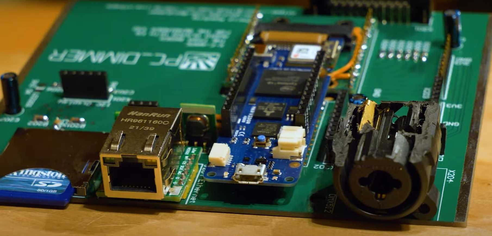
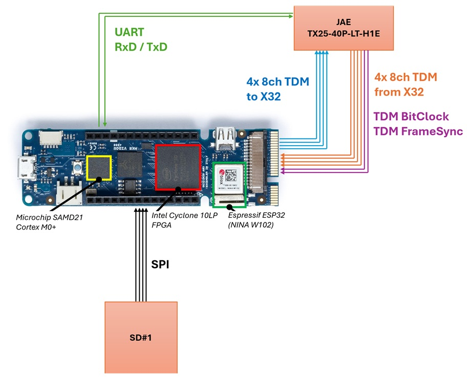
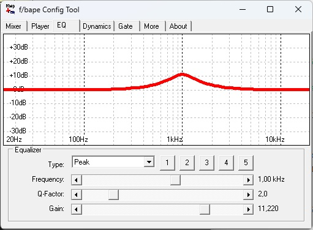

# X-f/bape - A DIY expansion-card for the Behringer X32

This repository contains the firmware for the X-f/bape DIY-ExpansionCard for the Behringer X32. This project
is based on the f/bape Audioplayer-project.

Three individual devices are part of this repository:

* Atmel/Microchip SAMD21 ATSAMD21G18A Cortex-M0+ 32-Bit Microcontroller
* Intel Cyclone 10LP 10CL016 FPGA
* uBlox NINA W102 (ESP32 D0WDQ6 Dual-Core)

## Main-Features of the system
- [x] Card receives, mix and sends 32 audio-channels with 48kHz and 24bit
- [x] MP3-Playback via SD-Card
- [x] Card can be controlled via original X32-interface
- [x] Control via Webinterface (WiFi)
- [x] Control via ASCII-based commands via USB, WiFi and Ethernet
- [x] DMX512-output
- [x] Parametric-Equalizers
- [x] Dynamic Audio-Compression (Stereo)
- [x] Optional: control card via MQTT
- [x] Optional: multi-channel analog Audio-Output via PDM
- [x] Optional: Noise-Gates
- [x] Optional: Bluetooth-A2DP-Sink
- [x] Optional: 24dB/oct Linkwitz-Riley Crossover for tweeter and subwoofer
- [x] Prepared: Support for the XTouch-Control

## Current status of the project
So far, the project is more of a "proof of concept". The audio-volume settings, the EQs and the dynamic compressor work well. But there are still a few small bugs in the system that don't make it easy to use at a live-event at the moment:

- [ ] EQs crackle on adjusting the frequency -> problem is solved when using a steep low-pass-filter with a cutoff frequency <=24kHz
- [ ] Audio sent back to the X32 has different volumes on different channels -> probably a bit-shift-error
- [ ] MP3s with 44,1kHz have a slight noise -> implement sample-rate conversion to 48kHz (already prepared, but FPGA is a bit small)
- [ ] Support for the XTouch is working in general, but the performance is not good yet -> optimize code
- [ ] Bluetooth is not working together with other features -> optimize code in NINA/ESP32 to save more space to enable BT

## Overview
The SAMD21 is used as an USB-2-UART converter for controlling and updating the individual devices. The device also controls the small I2C-display and communicates over the W5500-IC with your ethernet.
The FPGA receives audio-data via four TDM connections and control data via an UART-connection from the NINA W102. It also implements parametric equalizers, 36-channel volume-controls and a dynamic compression. A 24dB/oct Linkwitz-Riley Crossover is prepared but does not fit into the small FPGA yet.
The uBlox NINA W102 (ESP32) acts as a WiFi Accesspoint with webserver and implements the SD-card interface with MP3-decoder. It can be used to adjust audio-volume, select MP3-tracks adjust the equalizer and other functions of the system. It feeds the audio-data via I2S to the FPGA. It can be used to act as a Bluetooth-A2DP-sink as well.

As the original routing-functions of the Behringer X32 can still be used to route the individual channels, we are gaining more degree of freedom:
Using the 32 regular channels of the X32 and routing additional 32 channels from the AES50-connection to the X-f/bape-card, we can mix up to 64 channels in realtime with the X32. The X-f/bape will feed a submix to two of the 32 return-channels, that can be routed to two of the 6 AUX-Channels.
As the Cyclone 10LP is not the largest FPGA we are a bit limited with the EQing, but a 5-band PEQ with Compression can be added to the sum.

## Connections
USB -> SAMD21 <-> FPGA <-> ESP32

## Uploading/Updating the firmware(s)
As this system uses several controllers and ICs, a total of three different firmwares have to be compiled and uploaded. The USB-port is connected to the SAMD21. So this is the first place for updates. As the SAMD21 acts as a JTAG-uploader for the FPGA, too, it will upload the bitstream for the FPGA together with its firmware. Finally, the SAMD21 can be set to an upload-mode, to update the NINA W102-module (ESP32).

### SAMD21 with bitstream for Intel Cyclone 10-FPGA
Start Intel Quartus Prime Lite and compile the logic. If you alreade have a file "bitstream.h" this is not nescessary. As the FPGA bitstream is part of the SAMD21 firmware, you have to update the FPGA-bitstream using this command before uploading the code to SAMD21:
    update_fpga_bitstream.bat

This batch-file will call the following command, to convert the TabularTextFile (TTF) into an Arduino-Header:

    ..\FPGA\Tools\vidorcvt\vidorcvt.exe < ..\FPGA\output_files\Audioplayer.ttf > bitstream.h
	
Now start the Arduino IDE in version 2.x. Connect the SAMD via USB and connect Arduino IDE to the designated port. Select "Arduino MKR Vidor 4000" as board and upload the software using the regular upload-functions of Arduino IDE. Next to the regular Arduino upload-function, the software bossac.exe can be used to upload the firmware without Arduino IDE:

* connect SAMD21 via USB
* initialize the bootloader of the SAMD21:
`mode COM5: BAUD=1200 parity=N data=8 stop=1 > nul`
upload the firmware
`bossac.exe --port=COM21 -I -U true -e -w Audioplayer.ino.bin -R`

Caution: As the power-demand of this board is quite high, use a sufficient power-supply for your USB-hub and a good cable!

### NINA WiFi-module
A firmware-update to the ESP32 is only possible, when SAMD21-controller is set to "passthrough-mode" so that an UART communication to the ESP32 is possible directly through SAMD21 and the FPGA. So first, open a terminal and send the following command to the SAMD21:

    samd:update:nina
Alternatively you can open the updatemode using windows-command-line (in this example the Vidor is connected to COM5):

    echo samd:update:nina > COM5
Then use the Arduino IDE to upload the new software using the built-in uploading-functions for the ESP32 uBlox NINA W102. An upload is possible using the esptool.exe, directly:

    Tools\esptool.exe --chip esp32 --port COM5 --baud 921600 --before default_reset --after hard_reset write_flash -z --flash_mode dio --flash_freq 80m --flash_size 2MB 0x1000 Update\NINA.bootloader.bin 0x8000 Update\NINA.partitions.bin 0xe000 Tools\boot_app0.bin 0x10000 Update\NINA.bin
After uploading the new firmware, please reset the board using the RESET-button.

## Graphical User Interfaces

There are several options to control the system:
* WiFi via integrated Webinterface
* UART via FBAPE.EXE
* via ASCII-commands via UART and Ethernet

As the Ethernet-Contoller is connected only to the SAMD21, the webinterface of the NINA-W102 cannot be accessed. Maybe we can change this in a later design. But for now the ethernet-port is limited to plain ASCII-commands.